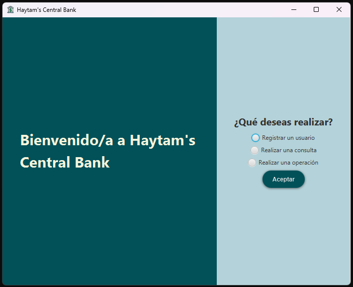
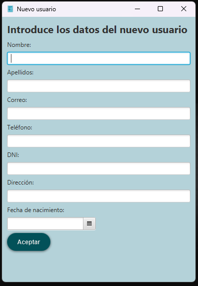
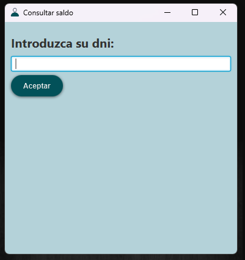
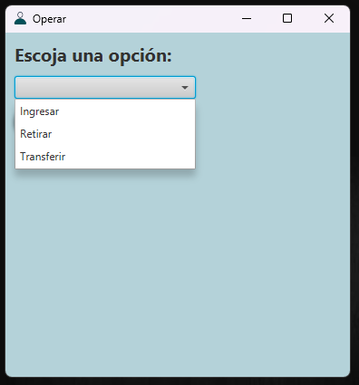

# Sistema de Gestión Bancaria

## Descripción

Este proyecto es una aplicación bancaria desarrollada en Java. La aplicación permite gestionar la información de los clientes de un banco y realizar operaciones bancarias básicas. La base de datos está diseñada con MySQL, e incluye tablas con claves primarias y ajenas para mantener la integridad de los datos.

## Características

- **Gestión de Usuarios**: Permite añadir, eliminar y actualizar información de usuarios en una base de datos MySQL.
- **Operaciones Bancarias Básicas**:
  - **Retirar Fondos**: Realiza retiros de las cuentas de los usuarios.
  - **Ingresar Fondos**: Permite realizar depósitos en las cuentas de los usuarios.
  - **Transferencias**: Facilita la transferencia de fondos entre cuentas de diferentes usuarios.
- **Validación de datos**: Antes de insertar cualquier usuario se realiza una validación de la información acerca de este. Se comprueba el formato del dni, correo y número de teléfono con el fin
de evitar datos erróneos y problemas de cara a la integridad de los datos.
## Tecnologías Utilizadas

- **Lenguaje de Programación**: Java
- **Base de Datos**: MySQL
- **Interfaz de Usuario**: JavaFX
- **Gestión de Proyectos**: Maven
- **Entorno de desarrollo**: IntelliJ IDEA
## Interfaz Gráfica

- **Elección de una de las 3 opciones. Registrar un nuevo cliente, consultar el saldo de un cliente o realizar alguna operación.**
  

---

- **Registrar un nuevo usuario proporcionando los datos demandados correctamente para su posterior validación y registro en la base de datos.**
  

---

- **Realizar una consulta del saldo de un cliente proporcionando su dni.**
  

---

- **Escoger una de las tres operaciones. Se puede hacer un ingreso o un retiro de una cuenta determinada, o una transferencia entre dos cuentas existentes.**
  

  ---

- **Las 3 operaciones básicas disponibles.**
  
